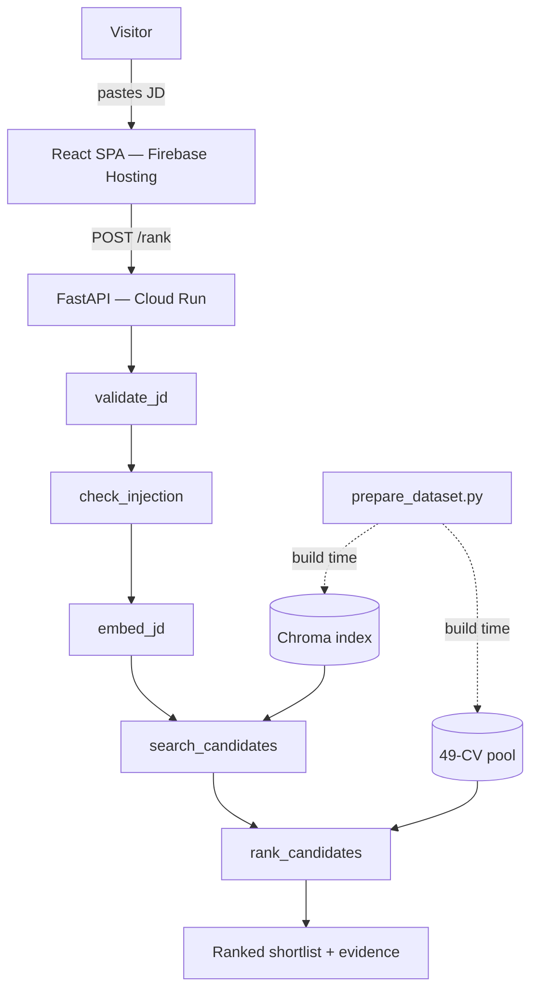

# Recruiter Assistant Agent

> A LangGraph agent that ranks a fixed CV pool against any job description, returning a scored shortlist with per-candidate evidence in a single API call.

[](https://portfolio-496111.web.app/)


## TL;DR

| | |
|---|---|
| **Problem** | HR recruiters spend hours opening resume PDFs one by one after an ATS keyword search, with no auditable rationale behind each decision. |
| **Solution** | A LangGraph screening agent that embeds a job description, retrieves semantically similar candidates, and ranks them with matched/missing requirements backed by resume evidence. |
| **Stack** | LangGraph, FastAPI, LiteLLM (Gemini 2.5 Flash), Chroma, React 19, Tailwind CSS, GCP Cloud Run, Firebase Hosting |
| **Result** | 84% agreement with hand-labeled ground truth (target ≥ 80%); live at [portfolio-496111.web.app](https://portfolio-496111.web.app/) |

## Why this exists

In-house HR recruiters typically export candidate lists from their ATS using keyword queries derived from the job description, then open each remaining resume PDF manually, mentally score it against requirements, and assemble a shortlist in a notepad or spreadsheet. The process is slow, inconsistent, and leaves no auditable trail — strong candidates get missed, weak ones slip through, and the rationale behind each decision disappears with the session.

This demo simulates that screening pass: a visitor submits a job description as plain text and receives an ordered shortlist from a prepared candidate pool, with the resume evidence behind every ranking position. No PDF needs to be opened.

## What it does

| Need | Solution |
|---|---|
| Shortlist candidates without opening individual PDFs | LangGraph graph produces a ranked shortlist from a single JD submission |
| Understand why each candidate was ranked | Every shortlist row shows matched and missing requirements with resume evidence |
| Override the agent's ranking | Shortlist / reject controls per candidate; decisions persisted to `localStorage` |
| Ensure no demographic bias reached the ranking | PII (name, email, address) scrubbed at build time; demographic fields never reach the ranker prompt |
| Audit the candidate pool itself | "About this dataset" modal surfaces pool size, excluded CV list, and the reason each was excluded |

## Architecture



> Dashed arrows are build-time writes (run once before deploy); solid arrows are request-time data flow.

| Component | Technology | Role |
|---|---|---|
| Frontend SPA | React 19 + Vite + Tailwind + TanStack Query | JD input, shortlist display, override controls, dataset modal |
| Backend API | FastAPI on GCP Cloud Run | `POST /rank` endpoint + `GET /dataset` |
| Screening graph | LangGraph `StateGraph` | 5-node pipeline with typed state and early-exit error routing |
| LLM access | LiteLLM (Gemini 2.5 Flash primary, OpenAI fallback) | JD embedding + candidate ranking |
| Vector store | Chroma (local, baked into Docker image) | Semantic nearest-neighbour retrieval over the CV pool |
| Dataset prep | `scripts/prepare_dataset.py` (build time only) | Parse → injection-check → PII-scrub → embed → index |

## How it was built

### Agent flow

The LangGraph `StateGraph` runs five nodes in sequence. Each node receives and returns `ScreeningState`; if a node sets an error, a conditional edge routes directly to `END` and no further nodes execute.

| Node | Purpose |
|---|---|
| `validate_jd` | Rejects JDs that are too short (<50 chars) or contain only stopwords — no LLM call wasted |
| `check_injection` | Runs the regex injection classifier on the JD text; rejects on match |
| `embed_jd` | Converts the JD to a vector embedding via LiteLLM |
| `search_candidates` | Queries Chroma for the top-15 semantically similar candidates |
| `rank_candidates` | Sends JD + candidates to the LLM; parses the response into a `ShortlistResponse` Pydantic schema |

### Key architectural decisions

**Chroma baked into the Docker image** — the CV pool is fixed at ~49 documents and built once. Running Chroma as a separate service would add a runtime dependency, a network hop, and a new failure mode for zero benefit at this scale. The trade-off: updating the pool requires a rebuild and redeploy, not a hot patch.

**LiteLLM as the LLM abstraction layer** — the same `complete()` and `embed()` calls work for Gemini and OpenAI. Gemini's free tier is the primary provider; OpenAI is the fallback if quota runs out. Swapping providers is one env-var change, not a code change.

**Build-time / runtime split** — `scripts/prepare_dataset.py` runs once before the image is built: it parses Kaggle CVs, runs the injection classifier on each, scrubs PII (names, emails, demographic fields), builds the Chroma index, and writes the parsed pool and an exclusion log. The runtime app loads these artifacts read-only and never accepts new CVs.

**LangGraph `StateGraph` for a 5-node pipeline** — conditional edges give the pipeline early-exit behavior without a web of nested try/except blocks. Every node is independently testable against `ScreeningState` dicts. The graph is compiled once at module load time and invoked per request.

### Stack choices

| Technology | Why this over the alternative |
|---|---|
| FastAPI | Pydantic-native, async-capable, minimal cold-start overhead — right for a single endpoint on Cloud Run |
| LangGraph | Explicit typed-state graph makes the pipeline observable and node-testable; a bare function chain loses early-exit routing and state traceability |
| LiteLLM | One client for any provider; provider swap is one env-var change — the `openai` SDK or `google-generativeai` each lock to a single vendor |
| Chroma | Zero-infra, files-only, fast for <50 docs — Pinecone or Weaviate would add cost and operational overhead with no benefit at this scale |
| `uv` | Single tool for env, lock, and run — faster installs than pip/poetry and fewer config files |
| Vitest | Vite-native, no Babel configuration needed — measurably faster than Jest for this Vite-based project |

### Security guardrails

**Threat model:** a CV or JD containing adversarial text could override the system prompt, causing the agent to produce fabricated rankings, leak instructions, or behave unexpectedly.

**Mitigations:**

1. **Injection classifier** — 12 regex patterns (`ignore previous instructions`, `jailbreak`, `act as`, etc.) run deterministically at dataset-prep time on every CV and at request time on every JD. CVs that match are excluded from the pool with reason `injection_detected` in `exclusions.json`; JD matches return a `422` with a plain-language error.
2. **Delimited XML fences** — untrusted content is wrapped in `<job_description>` and `<candidates>` tags in every LLM call. System instructions and user-supplied content are never concatenated as raw strings.
3. **Pydantic schema enforcement** — `rank_candidates` expects a `ShortlistResponse`; any deviation from the schema is rejected, not silently tolerated or auto-repaired.
4. **Hallucination guard** — `rank_candidates` validates every `candidate_id` returned by the LLM against the queried pool. Fabricated IDs are dropped before the response leaves the node.
5. **Regression fixture suite** — `backend/tests/guardrails/` contains known injection payloads. These tests must stay green.

### Edge cases handled

- JD under 50 characters → `invalid_jd` error before any LLM call
- JD containing only stopwords → `invalid_jd` error
- Injection pattern in JD text → `injection_detected` error, `422 HTTP`
- LLM returns a `candidate_id` not in the queried pool → dropped (hallucination guard)
- `embed()` or LLM call raises → `ranking_failed` error, `500 HTTP`
- `localStorage` unavailable (private browsing) → overrides degrade to session-only without crashing

### What's deliberately out of scope

Visitor-supplied candidate resumes, runtime CV ingestion, candidate sourcing from external services, ATS write-back, interview scheduling, any candidate-facing communication, pools above ~50 CVs, and multi-recruiter collaboration. These are excluded by the SPEC, not deferred for cost reasons.

## Repo layout

```
backend/
  src/
    features/
      ranking/          # JD → shortlist: graph, nodes, prompts, schemas
      dataset/          # transparency view (GET /dataset)
    lib/
      llm/              # LiteLLM client + provider routing
      vectorstore/      # Chroma read-only loader
      guardrails/       # injection classifier, fence builder, schema validator
    graph/              # LangGraph state + compiled graph
    main.py
  tests/
    guardrails/         # injection regression fixtures — must stay green
frontend/
  src/
    features/
      ranking/          # JD input, shortlist, candidate rows, override controls
      dataset/          # transparency modal
    components/         # DatasetLink — shared header component
scripts/
  prepare_dataset.py    # build time: parse → scrub PII → embed → index
  eval_harness.py       # agreement-rate evaluation against ground-truth labels
data/
  pool/                 # 49 parsed candidates baked into image
  exclusions.json       # surfaced in the transparency view
  chroma/               # Chroma vector index baked into image
  eval/                 # ground-truth labels + evaluation report
docs/
  spec/
  plans/
  tech-specs/
```

## Evaluation

| Metric | Value |
|---|---|
| Agreement rate (agent vs. hand-labeled ground truth) | **84%** |
| SPEC target | ≥ 80% |
| Candidates in pool | 49 |
| JDs evaluated | 5 |
| Model | `gemini/gemini-2.5-flash`, temperature 0 |
| Full overlap (5 / 5 candidates matched) | 1 JD — Senior Data Scientist |
| Partial overlap (4 / 5 candidates matched) | 4 JDs |

Methodology: `scripts/eval_harness.py` invokes the screening graph directly for each JD in `data/eval/jds.json`, compares the agent's top-5 to hand-labeled ground truth in `data/eval/ground_truth.json`, and writes `data/eval/report.json`. Report committed at [`data/eval/report.json`](data/eval/report.json).

## Running it

**Backend**
```bash
cd backend
uv sync
uv run uvicorn src.main:app --reload
```

**Frontend**
```bash
cd frontend
pnpm install && pnpm dev
```

**Tests**
```bash
# backend — 73 passing
cd backend && uv run pytest

# guardrail regression only
uv run pytest tests/guardrails -k injection

# frontend — 40 passing
cd frontend && pnpm test
```

**Dataset prep** (run once before deploy if the pool changes)
```bash
uv run python scripts/prepare_dataset.py
```

## Docs

| Document | Path |
|---|---|
| Product spec | [`docs/spec/recruiter-assistant-agent.md`](docs/spec/recruiter-assistant-agent.md) |
| Implementation plan | [`docs/plans/recruiter-assistant-agent.md`](docs/plans/recruiter-assistant-agent.md) |
| Tech specs | [`docs/tech-specs/`](docs/tech-specs/) |
